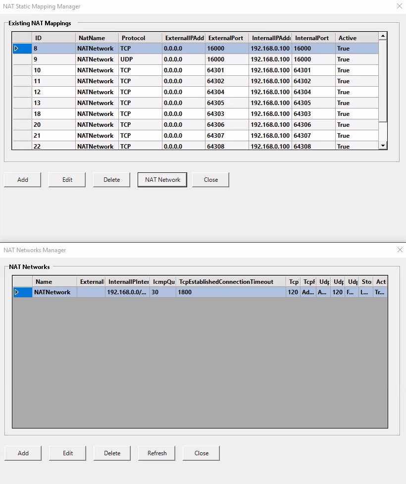

# NatMappingManager | Windows NAT Manager GUI

NatMappingManager is a PowerShell-based GUI tool for managing both NAT (Network Address Translation) static mappings and NAT networks on Windows systems. The tool provides an easy-to-use interface that allows you to view, add, edit, and delete NAT mappings as well as manage NAT networks with just a few clicks.

---

## Features

- View all NAT static mappings in an easy-to-read table.
- Add new NAT static mappings with required parameters.
- Edit existing NAT mappings.
- Delete NAT mappings with a single click.
- Manage NAT networks (view, add, edit, delete)
- GUI-based interface using Windows Forms.

---

## Prerequisites

- **Windows PowerShell** (v5.1 or later).
- **Administrator Privileges**: Required to execute NAT-related commands.
- **NetNat Module**: The NetNat module must be installed and enabled. This is available on:
  - Windows Server 2016 and later.
  - Windows 10 (Pro, Enterprise, or Education).

---
