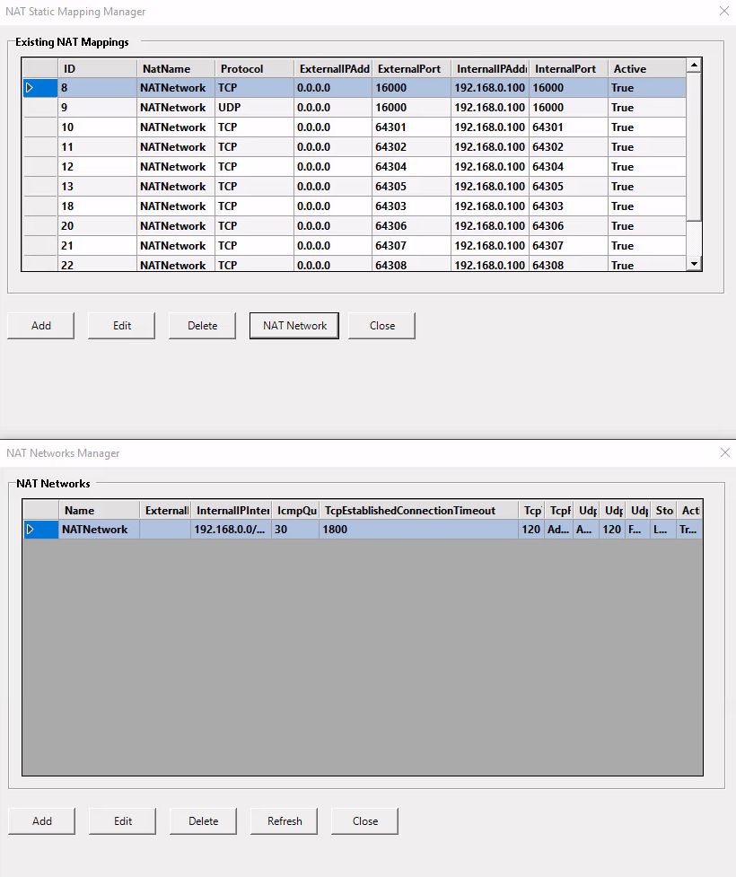

# NatMappingManager | Windows NAT Manager GUI

**🎯 The simplest and most powerful graphical interface for managing Windows NAT Static Mappings & NAT Networks**

---

**NatMappingManager** is a modern, user-friendly **PowerShell GUI tool** that lets you manage NAT Static Mappings and NAT Networks on Windows with just a few clicks — **no more struggling with PowerShell cmdlets**.

Perfect for:
- Hyper-V labs
- Windows Server NAT routers
- Port forwarding for VMs, containers, or services
- Home labs and developers

---

## ✨ Features

- Clean, easy-to-read table of all NAT Static Mappings
- Add, edit, and delete NAT Static Mappings
- Full NAT Network management (create, edit, delete)
- Smart input validation (IPs, ports 1-65535, CIDR, duplicate detection)
- Dropdowns for NAT names and protocols (no more typos)
- Safe rollback on failed edits
- Confirmation dialogs before deletions
- Refresh button + automatic updates
- Clear, context-rich error messages
- Warnings for critical actions (e.g., NAT network changes)
- Modern Windows Forms UI

---

## 🚀 Quick Start (under 60 seconds)

1. **Download the latest release**  
   → [Get the latest version](https://github.com/2KU77B0N3S/NatMappingManager/releases/latest)

2. Extract the ZIP file

3. **Right-click `NatMappingManager.ps1` → "Run with PowerShell"**  
   (Run as Administrator!)

Done! The clean GUI opens instantly.

---

## ⚙️ Prerequisites

- **Windows 10 / 11** (Pro, Enterprise, Education) or **Windows Server 2016+**
- **PowerShell 5.1** or newer (included by default)
- **Administrator privileges**
- **NetNat module** (built into Windows — no extra install needed)

> The tool automatically checks all prerequisites and shows friendly MessageBox errors if something is missing.

---

## ❓ FAQ

**Q: Does it work on Windows Home edition?**  
A: No — the NetNat module is only available on Pro, Enterprise, and Server editions.

**Q: Do I need to install anything?**  
A: No! Just run the `.ps1` file.

**Q: Is there a command-line version?**  
A: Currently GUI-only (CLI support may come in the future).

---

## ⭐ Why NatMappingManager?

Stop wasting time with `Add-NetNatStaticMapping`, `Get-NetNat`, and long command chains.  
**Fast. Safe. Beautiful.**

---

## 🤝 Contributing

Ideas? Bugs? Improvements?  
→ [Open an issue](https://github.com/2KU77B0N3S/NatMappingManager/issues)  
→ Pull requests are always welcome!

---

## 📄 License

This project is licensed under the **MIT License** — see the [LICENSE](LICENSE) file for details.

---

**💖 Like the tool? Please star the repository!**  
Every star helps other users discover it.

---

*Made with ❤️ for the Windows community*
